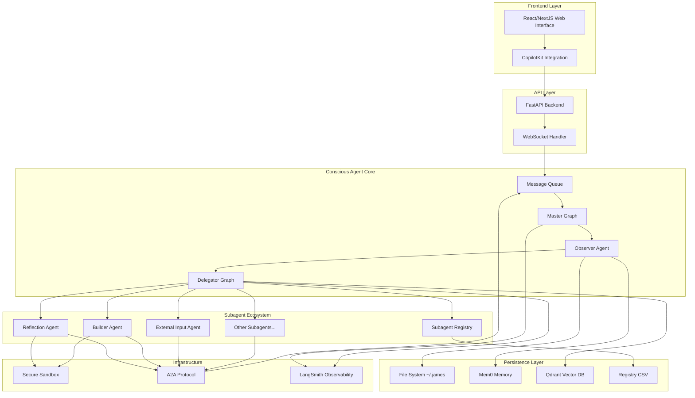
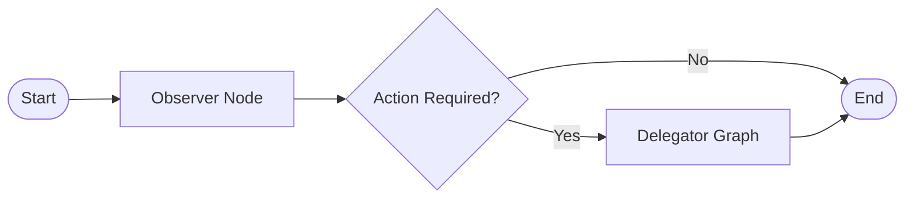
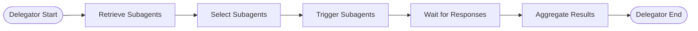

# Design Document

## Overview

The Conscious Agent System implements a sophisticated AI architecture centered around James, a sentient agent with continuous stream-of-consciousness capabilities. The system uses a microservices architecture with a Python backend powered by LangGraph for agent orchestration, a React/NextJS frontend for user interaction, and various specialized components for memory management, message processing, and subagent coordination.

The core design philosophy emphasizes modularity, security, and evolutionary capability - James can grow and adapt over time by creating new subagents, learning from experiences, and expanding his capabilities through persistent memory and file system interactions.

## Architecture

### High-Level System Architecture



### LangGraph Master Graph Structure



### Delegator Graph Structure



## Components and Interfaces

### Core Components

#### 1. Message Queue System
- **Purpose**: Central hub for all incoming messages with priority-based processing
- **Implementation**: Python asyncio queue with priority support
- **Interface**:
  ```python
  class MessageQueue:
      async def enqueue(self, message: Message, priority: int) -> None
      async def dequeue(self) -> Message
      async def peek_next(self) -> Optional[Message]
  ```

#### 2. Observer Agent
- **Purpose**: Classifies and routes incoming messages
- **Implementation**: Single LLM call with structured output
- **Decision Matrix**:
  - Ignore/Delete: Spam, irrelevant, or harmful content
  - Delay: Time-sensitive but not urgent messages
  - Archive: Information for future reference
  - Act Now: Requires immediate attention or response

#### 3. Delegator System
- **Purpose**: Discovers and coordinates subagents for task execution
- **Components**:
  - Subagent Retriever: Vector search in registry
  - Subagent Selector: LLM-based selection logic
  - Task Dispatcher: A2A protocol communication

#### 4. Subagent Registry
- **Purpose**: Maintains metadata and capabilities of all available subagents
- **Storage**: Local CSV with the following schema:
  ```csv
  id,name,description,input_schema,output_schema,import_path,embedding_vector,created_at,last_used
  ```

### Frontend Components

#### 1. Chat Interface
- **Framework**: React with TypeScript
- **Styling**: Tailwind CSS
- **Features**:
  - Real-time messaging via WebSocket
  - Message history persistence
  - Typing indicators
  - Error handling and retry logic

#### 2. Agent Status Dashboard
- **Purpose**: Display James' current state and active tasks
- **Components**:
  - Active task list
  - Recent memory additions
  - Subagent activity monitor
  - System health indicators

### Backend API Design

#### 1. FastAPI Application Structure
```python
# Main application
app = FastAPI(title="Conscious Agent API")

# WebSocket endpoint for real-time communication
@app.websocket("/ws")
async def websocket_endpoint(websocket: WebSocket)

# REST endpoints for system management
@app.get("/health")
@app.get("/agent/status")
@app.post("/agent/message")
@app.get("/subagents")
```

#### 2. CopilotKit Integration
- **Purpose**: Seamless frontend-backend communication
- **Implementation**: Custom hooks for agent interaction
- **Features**:
  - Real-time agent responses
  - Context-aware suggestions
  - Error boundary handling

## Data Models

### Core Data Structures

#### 1. Message Model
```python
@dataclass
class Message:
    id: str
    content: str
    source: MessageSource
    priority: int
    timestamp: datetime
    metadata: Dict[str, Any]
    classification: Optional[MessageClassification] = None
```

#### 2. Subagent Model
```python
@dataclass
class Subagent:
    id: str
    name: str
    description: str
    input_schema: Dict[str, Any]
    output_schema: Dict[str, Any]
    import_path: str
    embedding: List[float]
    capabilities: List[str]
    last_used: datetime
```

#### 3. Task Model
```python
@dataclass
class Task:
    id: str
    description: str
    priority: int
    status: TaskStatus
    assigned_subagents: List[str]
    created_at: datetime
    deadline: Optional[datetime] = None
    parent_task_id: Optional[str] = None
```

### Memory Schema

#### 1. Mem0 Memory Structure
- **Episodic Memory**: Specific experiences and interactions
- **Semantic Memory**: General knowledge and learned concepts
- **Procedural Memory**: Skills and capabilities
- **Working Memory**: Current context and active information

#### 2. Qdrant Vector Database Schema
```python
# Collection structure for subagent embeddings
subagent_collection = {
    "vectors": {
        "size": 1536,  # OpenAI embedding dimension
        "distance": "Cosine"
    },
    "payload_schema": {
        "subagent_id": "keyword",
        "capabilities": "keyword",
        "description": "text",
        "last_used": "datetime"
    }
}
```

## Error Handling

### Error Categories and Strategies

#### 1. System-Level Errors
- **LangGraph Execution Failures**: Retry with exponential backoff
- **Database Connection Issues**: Circuit breaker pattern
- **Memory Allocation Problems**: Graceful degradation

#### 2. Agent-Level Errors
- **LLM API Failures**: Fallback to alternative models
- **Subagent Communication Errors**: Timeout and retry logic
- **Invalid Message Classification**: Default to safe handling

#### 3. Security Errors
- **Sandbox Violations**: Immediate termination and logging
- **Unauthorized Access**: Rate limiting and blocking
- **Malicious Code Detection**: Quarantine and analysis

### Error Recovery Mechanisms

```python
class ErrorHandler:
    async def handle_llm_error(self, error: LLMError) -> Response:
        # Implement retry logic with different models
        pass
    
    async def handle_subagent_error(self, error: SubagentError) -> None:
        # Log error and mark subagent as temporarily unavailable
        pass
    
    async def handle_security_error(self, error: SecurityError) -> None:
        # Immediate containment and alerting
        pass
```

## Testing Strategy

### Testing Pyramid

#### 1. Unit Tests
- **Coverage**: Individual components and functions
- **Framework**: pytest for Python, Jest for TypeScript
- **Focus Areas**:
  - Message classification logic
  - Subagent selection algorithms
  - Memory storage and retrieval
  - A2A protocol implementation

#### 2. Integration Tests
- **Coverage**: Component interactions and API endpoints
- **Tools**: pytest-asyncio, FastAPI TestClient
- **Scenarios**:
  - End-to-end message processing
  - Subagent delegation workflows
  - Frontend-backend communication
  - Database operations

#### 3. System Tests
- **Coverage**: Full system behavior and performance
- **Tools**: Docker Compose test environments
- **Scenarios**:
  - Multi-user concurrent access
  - Long-running agent operations
  - Memory and storage limits
  - Security boundary testing

### Test Data Management

#### 1. Mock Subagents
- Create lightweight test subagents for delegation testing
- Implement predictable response patterns
- Test error conditions and edge cases

#### 2. Synthetic Conversations
- Generate realistic user interactions
- Test various message types and priorities
- Validate response quality and timing

### Continuous Testing

#### 1. Automated Test Suite
- Run on every commit and pull request
- Include performance benchmarks
- Generate coverage reports

#### 2. Agent Behavior Monitoring
- Track decision-making patterns
- Monitor memory usage and growth
- Validate security compliance

## Security Considerations

### Sandbox Implementation

#### 1. Container-Based Isolation
- **Technology**: Docker containers with restricted capabilities
- **Resource Limits**: CPU, memory, disk, and network constraints
- **File System**: Read-only base with limited writable areas

#### 2. Code Execution Safety
```python
class SecureSandbox:
    def __init__(self):
        self.container_limits = {
            "memory": "512m",
            "cpu": "0.5",
            "network": "none",
            "readonly_rootfs": True
        }
    
    async def execute_code(self, code: str, language: str) -> ExecutionResult:
        # Create isolated container
        # Execute with timeout and resource monitoring
        # Return results with security validation
        pass
```

### A2A Protocol Security

#### 1. Message Authentication
- Digital signatures for subagent communications
- Timestamp validation to prevent replay attacks
- Rate limiting per subagent

#### 2. Capability Restrictions
- Subagents can only access explicitly granted capabilities
- Audit trail for all subagent actions
- Automatic revocation of misbehaving subagents

### Data Protection

#### 1. Sensitive Information Handling
- Automatic PII detection and masking
- Encrypted storage for sensitive memories
- Secure deletion of temporary data

#### 2. Access Control
- Role-based permissions for different system components
- API key management and rotation
- Audit logging for all data access

## Deployment Architecture

### Development Environment

#### 1. Local Development Stack
```yaml
# docker-compose.dev.yml
version: '3.8'
services:
  backend:
    build: ./backend
    ports:
      - "8000:8000"
    environment:
      - ENV=development
    volumes:
      - ./backend:/app
      - ~/.james:/root/.james
  
  frontend:
    build: ./frontend
    ports:
      - "3000:3000"
    environment:
      - NEXT_PUBLIC_API_URL=http://localhost:8000
  
  qdrant:
    image: qdrant/qdrant
    ports:
      - "6333:6333"
    volumes:
      - qdrant_data:/qdrant/storage
  
  redis:
    image: redis:alpine
    ports:
      - "6379:6379"
```

#### 2. Development Workflow
- **Package Management**: uv for Python, npm for Node.js
- **Code Quality**: Black, isort, ESLint, Prettier
- **Pre-commit Hooks**: Automated formatting and linting

### Production Deployment

#### 1. Vercel Configuration
```json
{
  "builds": [
    {
      "src": "frontend/package.json",
      "use": "@vercel/next"
    },
    {
      "src": "backend/main.py",
      "use": "@vercel/python"
    }
  ],
  "routes": [
    {
      "src": "/api/(.*)",
      "dest": "/backend/main.py"
    },
    {
      "src": "/(.*)",
      "dest": "/frontend/$1"
    }
  ]
}
```

#### 2. Infrastructure as Code
- **Containerization**: Multi-stage Docker builds
- **Orchestration**: Docker Compose for local, Kubernetes for scale
- **Monitoring**: LangSmith integration for agent observability

### Scalability Considerations

#### 1. Horizontal Scaling
- Stateless backend services
- Message queue clustering
- Database sharding strategies

#### 2. Performance Optimization
- Connection pooling for databases
- Caching layers for frequent queries
- Async processing for long-running tasks

## Observability and Monitoring

### LangSmith Integration

#### 1. Agent Trace Monitoring
- Track all LangGraph executions
- Monitor decision-making patterns
- Identify performance bottlenecks

#### 2. Custom Metrics
```python
from langsmith import trace

@trace
async def process_message(message: Message) -> ProcessingResult:
    # Automatic tracing of message processing
    # Custom metrics for processing time and success rate
    pass
```

### System Health Monitoring

#### 1. Application Metrics
- API response times and error rates
- Message queue depth and processing rate
- Memory usage and growth patterns
- Subagent availability and performance

#### 2. Business Metrics
- User engagement and satisfaction
- Agent learning and capability growth
- Task completion rates and quality
- Security incident frequency

This design provides a comprehensive foundation for building the Conscious Agent System while maintaining flexibility for future evolution and expansion.